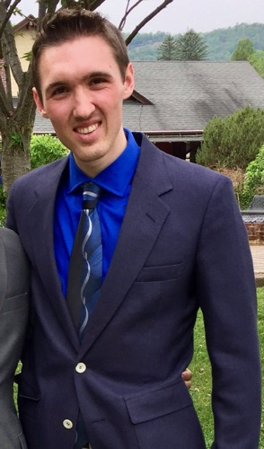

  

## Contact

**Email:** [kyleakurkela@gmail.com](mailto:kyleakurkela@gmail.com)  
**Phone:** 631-926-5373  
**Twitter:** [twitter.com/kyleakurkela](https://twitter.com/kyleakurkela)  
**Github:** @kkurkela (personal), @kakurk (Boston College)  
**Google Scholar:** [scholar.google.com/citations?user=eWP1fJ8AAAAJ&hl=en](https://scholar.google.com/citations?user=eWP1fJ8AAAAJ&hl=en)  

## Biography

I graduated from Cornell University in 2014 with a B.S. in Human Development with a concentration in Behavioral Neuroscience. After graduation, I spent four years researching the neural correlates of various memory phenomena.  

I am generally interested in studying the cognitive neuroscience of memory. Within memory, I am particularly interested in the study of false memory (What are the neural mechanisms that support the false endorsement of having seen an item previously? Can there be multiple neural mechanisms that support this phenomenon?), associative memory (We often do not need to recall _single_ elements, but more complex, multi-element events. What brain areas support memory for associative, multi-element memoranda?), emotional and contextual influences on memory (How does the emotional valence and arousal of an event impact the neural architecture that supports memory? How does this modulation interact with memory for peripheral, associative details?), and event cognition (Our world is inherently continuous, but our memory of it is segmented. How is this the case? How does the brain segment this continuous stream of sensory information and store it for later recall?). To examine the neural correlates of these phenomena, I use non-invasive techniques such as fMRI, EEG, and tDCS.  

Additionally, I am dedicated to advancing responsible research practices in order to address the replicability "crisis" in psychological and cognitive science. Therefore, I promote the use of pre-registrations ([example](https://osf.io/jmg6b/?view_only=fe2c93deb2b74481997b18359fb7c84d)), open data, and open source, version controlled code ([examples](https://github.com/kkurkela)) to increase replicability and encourage open science.  

Outside of the lab I love to ski, play soccer, run, read a good book, and I am an avid soccer fan (Barclay's Premier League, USMNT, USWNT).  

## Past Work Experience

[_Memory Modulation Laboratory_](http://www.thememolab.org/)  
Dr. Maureen Ritchey (@ritcheym)  
Research Specialist  
July 2016 - Present  

I am currently working full time in Dr. Maureen Ritchey's Memory Modulation Lab (@memobc). As the lab's Research Specialist, I am responsible for the creation and maintenance of custom analysis scripts. For example, I am responsible for the maintenance of a series of scripts for the purposes of MRI data quality assurance ([example](https://github.com/memobc/memolab-fmri-qa)), the analysis of psychophysiology data, and the efficient running of single trial models.  

I am also responsible for running various memory experiments. Currently, we are working on a series of experiments investigating the interaction of context and emotion on memory, investigating the influence of emotion on associative memory, as well as developing a protocol for running a new transcranial direct current stimulation (tDCS) experiment to manipulate memory networks.  

[_Cognitive Aging and Neuroimaging Laboratory_](http://canlab.la.psu.edu/)  
Dr. Nancy Dennis  
Laboratory Manager  
July 2014 - July 2016  

I spent two years as the laboratory manager for Dr. Nancy Dennis' CAN Lab. In addition to administrative responsibilities (e.g., NSF Grant reporting, budgeting), I was responsible for the collection of an entire sample of older adults (ages 60+) for an [NSF funded study on the neural correlates of false memory in aging](http://dx.doi.org/10.1016/j.neurobiolaging.2017.10.020). In addition, I was able to work with Dr. Dennis and others on: 1.) [a meta-analysis on the neural correlates supporting false memory](http://www.sciencedirect.com/science/article/pii/S0028393215302463), 2.) a large experiment on data quality before and after a scanner upgrade at Penn State's imaging center, 3.) a collaborative study on the common neural correlates of working memory and motor control in aging, and 4.) a new analysis of a dataset on source memory in aging.  

I also presently serve as a part-time methods/programming consultant for the CAN lab, assisting with the maintenance and writing of stimulus presentation ([example](https://github.com/kkurkela/ICEE)) and fMRI preprocessing and analysis code ([example](https://github.com/kkurkela/FAME-RSA)).  

[_Laboratory of Brain and Cognition_](http://lbc.human.cornell.edu/Home.html)  
Dr. Nathan Spreng  
Undergraduate Research Assistant  
July 2013 - May 2014  

I spent the entirety of my senior year working in Dr. Nathan Spreng's Laboratory of Brain and Cognition, where I assisted in fMRI data analysis and EEG data collection. Specifically, I ran a first level univariate analysis on an MRI experiment investigating the role of the default mode network in working memory. I also worked with other undergraduate RAs to write a MATLAB script to extract beta-estimates using the Marsbar toolbox for this project, which resulted in a conference presentation. In addition, I helped collect EEG data for a related project which also investigated the default mode network's contribution to working memory.  

[_Memory and Neuroscience Laboratory_](https://www.human.cornell.edu/hd/research/labs/memorylab/home)  
Dr. Charles Brainerd  
Undergraduate Research Assistant  
January 2014 - May 2014  

I spent the last semester of my senior year working in Dr. Charles Brainerd's Memory and Neuroscience Lab. While in lab, I was put on a project where I was asked to figure out how to use multiple imputations in SPSS to analyze a large online experiment examining the use of "gist" information in decision making with lots of missing data. I also took part in a weekly directed reading led by Dr. Brainerd on Memory and Aging.  

[_Personality, Attachment, and Control Laboratory_](http://people.psych.cornell.edu/~pac_lab/)  
Dr. Vivian Zayas  
Co-Head EEG Research Assistant  
September 2012 - May 2014  

I spent my junior and senior years working in the PAC lab, where I held the title of Co-Head EEG RA. In the PAC lab, I served as a confederate in a variety of psychology experiments, specifically in studies looking at social exclusion using the odd-ball paradigm. I was also in charge of scheduling and running EEG participants, maintaining the EEG equipment, rejecting artifactual components using ICA, and for training other RAs to run EEG experiments.  

## Skills

_Programming Languages_  
**Fluent**: MATLAB, R  
**Proficient**: Unix Shell Scripting, Javascript  
**Familiar**: Python  

_Software_  
**Fluent**: SPM ([example](https://github.com/kkurkela/KyleSPMToolbox)), GingerALE ([publication](http://www.sciencedirect.com/science/article/pii/S0028393215302463)), MRIcron, Cogent, psychtoolbox ([example](https://github.com/kkurkela/ICEE)), gPPI ([example](https://github.com/kkurkela/KyleSPMToolbox/tree/master/gPPI)), CoSMoMVPA ([example](https://github.com/kkurkela/FAME-RSA)), PsPM ([example](https://github.com/memobc/memolab-psychophys-pipeline)), git, WFU Pickatlas, tidyverse ([example](https://github.com/kkurkela/CDur)), R Markdown ([example](https://github.com/kkurkela/CDur)), lme4  
**Proficient**: FSL, MarsBaR, IBM SPSS, Mango, E-Prime, ArtRepair ([example](https://github.com/memobc/memolab-fmri-qa)), conn, jspsych, LaTeX ([example](https://github.com/kkurkela/CDur)), HCP workbench  
**Familiar**: EEGLab, Google Sketchup, PsychoPy2, PLS  

_Data Collection_  
**Fluent**: functional magnetic resonance imaging (fMRI)  
**Proficient**: electroencephalography (EEG)   
**Familiar**: transcranial direct current stimulation (tDCS), skin conductance response (SCR)  

## Publications

Diaz, M. T., Taber-Thomas, B, Bai, X. X., **Kurkela, K. A.**, Dennis, N. A., Perez-Edgar, K., Hillary, F. (in prep). Reliability of Functional Imaging Measurements Before and After a Siemens Scanner Upgrade.  

**Kurkela, K.A.** & Dennis, N.A. (2016). [Event-related fMRI studies of false memory: an activation likelihood estimation meta-analysis](http://www.sciencedirect.com/science/article/pii/S0028393215302463). _Neuropsychologia_, 81: 149-167.  

## Conference Presentations

**Kurkela, K.A.**, Samide, R., Ritchey, M. (March, 2018). Transient and sustained processes involved in encoding emotional information. Abstract submitted to the Cognitive Neuroscience Society Annual Meeting, Boston, MA, USA.  

Samide, R., **Kurkela, K. A.**, Ritchey, M. (November 2017). Effects of contextual reinstatement on retrieval of item-emotion associations. Poster presented at the annual meeting of the Society for Neuroscience, Washington D.C., USA.  

Neely, K.A., **Kurkela, K.A.**, Goodman, J.T., Samimy, S., Blouch, S.L., Chennavasin, A., Diaz, M.T., & Dennis, N.A. (November 2017). Common neural substrates support visually guided force control and working memory in healthy older adults. Poster presented at the annual meeting of the Society for Neuroscience, Washington D.C., USA.  

Turney, I. T., **Kurkela, K.A.**, Dennis, N.A. (April, 2016). Understanding the role of perceptual relatedness to false memories in aging. Poster presented at the Cognitive Aging Conference, Atlanta, GA, USA.  

**Kurkela, K.A.** & Dennis, N.A. (April, 2016). Event-related fMRI studies of false memory: an activation likelihood estimation meta-analysis. Poster presented at the Cognitive Neuroscience Society Annual Meeting, New York, NY, USA.  

Venkatesan, U., Dennis, N.A., **Kurkela, K.**, & Cabeza, R (February, 2016). Neuroimaging Source Memory in
Aging: Putting the Context Memory Deficit in Context. Poster presented at International Neuropsychological Society Annual Meeting, Boston, MA, USA.  

Spreng, R.N., DuPre, E., Selarka, D., Garcia, J., Gojkovic, S., Mildner, J., **Kurkela, K.** & Turner, G.R. (April, 2014). Contextual relevant default network activity facilitates working memory performance. Cognitive Neuroscience Society Annual Meeting, Boston, MA, USA.  

## Current Projects

_Interaction of Emotion and Context on Memory_    
My colleagues and I am currently exploring the interaction of emotion and context on memory, specifically when the background context is shifted versus reinstated during retrieval (see [pre-registration](https://osf.io/jmg6b/?view_only=fe2c93deb2b74481997b18359fb7c84d)).  

_Transcranial Direct Current Stimulation of Memory Networks_  
My colleagues and I are also currently seeing if it is possible to modulate memory performance using network targeted tDCS. Specifically, we are interested in investigating if targeting the posterior-medial memory network will modulate the impact of contextual reinstatement on memory performance.  

_Effect of Emotion on Memory for overlapping multi-element memoranda_    
I am also working on developing a study to examine the influences of emotion on associative memory, specifically on overlapping associations that can be integrated into events engrams.  
