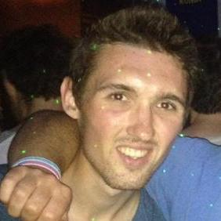

  

## Contact

Email: [kyleakurkela@gmail.com](mailto:kyleakurkela@gmail.com)  
Phone: 631-926-5373  
Twitter: [twitter.com/kyleakurkela](https://twitter.com/kyleakurkela)  
Github: @kkurkela (personal), @kakurk (Boston College)  
Google Scholar: [scholar.google.com/citations?user=eWP1fJ8AAAAJ&hl=en](https://scholar.google.com/citations?user=eWP1fJ8AAAAJ&hl=en)  

## Biography

I graduated from Cornell University in 2014 with a degree in Human Development with a concentration in Developmental Behavioral Neuroscience. I am interested in studying the cognitive neuroscience of memory. Within memory, I am particularly interested in the study of false memory, associative memory, emotional and contextual influences, and event cognition. I am interested in the study of the neural correlates of these phenomena using non-invasive techniques such as fMRI, EEG, and tDCS.  

I also have a particularly strong interest in helping to solve the replicability "crisis" in psychological science. I am interested in the use of pre-registrations ([example](https://osf.io/jmg6b/?view_only=fe2c93deb2b74481997b18359fb7c84d)), open data, and open source, version controlled code ([examples](https://github.com/kkurkela)) to increase replicability in psychology and cognitive neuroscience.  

Outside of the lab I love to ski, play soccer, run, read a good book, and I am an avid soccer fan (Barclay's Premier League, USMNT, USWNT).  

## Past Work Experience

[_Memory Modulation Laboratory_](http://www.thememolab.org/)  
Dr. Maureen Ritchey (@ritcheym)  
Research Specialist  
July 2016 - Present  

I am currently working full time as a research specialist in Dr. Maureen Ritchey's Memory Modulation Lab (@memobc). I am responsible for the creation and maintenance of custom analysis pipelines ([example](https://github.com/memobc/memolab-fmri-qa)), running and analyzing behavioral experiments, as well as developing a protocol for running a new transcranial direct current stimulation (tDCS) study.

[_Cognitive Aging and Neuroimaging Laboratory_](http://canlab.la.psu.edu/)  
Dr. Nancy Dennis  
Laboratory Manager  
July 2014 - July 2016  

I spent two years as the laboratory manager for Dr. Nancy Dennis' CAN Lab. In addition to administrative responsibilities (e.g., NSF Grant reporting), I was responsible for the collection of an entire sample of older adults (ages 60+) for an [NSF funded study on false memory in aging](http://dx.doi.org/10.1016/j.neurobiolaging.2017.10.020). In addition, I was able to work with Dr. Dennis and others on: 1.) [a activation likelihood estimation meta-analysis on false memory](http://www.sciencedirect.com/science/article/pii/S0028393215302463), 2.) a large experiment on the data quality before and after a scanner upgrade at Penn State's imaging center, 3.) a cross-lab collaborative study on the common neural correlates of working memory and motor control, 4.) a new analysis of an old dataset on source memory in aging, and finally 5.) writing up a previously completed experiment on directed forgetting in aging.

I also presently serve as a part-time methods/programming consultant for the lab, assisting with the maintenance and writing of stimulus presentation ([example](https://github.com/kkurkela/ICEE)) and fMRI preprocessing and analysis code ([example](https://github.com/kkurkela/FAME-RSA)).

[_Laboratory of Brain and Cognition_](http://lbc.human.cornell.edu/Home.html)  
Dr. Nathan Spreng  
Undergraduate Research Assistant  
July 2013 - May 2014  

I spent the entirety of my senior year working in Dr. Nathan Spreng's Laboratory of Brain and Cognition, where I assisted in data analysis and data collection. Specifically, I ran a first level model on 25 subjects the lab collected using SPM's batch editor GUI. I also worked with other undergraduate RAs to write a MATLAB script to extract beta-estimates using the Marsbar toolbox. I also helped collect EEG data.  

[_Memory and Neuroscience Laboratory_](https://www.human.cornell.edu/hd/research/labs/memorylab/home)  
Dr. Charles Brainerd  
Undergraduate Research Assistant  
January 2014 - May 2014  

I spent the last semester of my senior year working in Dr. Charles Brainerd's Memory and Neuroscience Lab. While in lab, I was put on a project where I was asked to figure out how to use multiple imputation in SPSS to analyze a large online experiment with lots of missing data. I also took part in a weekly directed reading led by Dr. Brainerd on Memory and Aging.  

[_Personality, Attachment, and Control Laboratory_](http://people.psych.cornell.edu/~pac_lab/)  
Dr. Vivian Zayas  
Co-Head EEG Research Assistant  
September 2012 - May 2014  

I spent my junior and senior years working in the PAC lab, where I held the title of Co-Head EEG RA. In the PAC lab, I served as a confederate in a variety of behavioral psychology experiments, specifically in studies looking at social exclusion using the odd-ball paradigm. I was also in charge of scheduling and running EEG participants, maintaining the EEG equipment, rejecting artifactual components using ICA, and for training other RAs to run EEG experiments.  

## Skills

_Programming Languages_  
**Fluent**: MATLAB, R/RStudio  
**Proficient**: Unix Bash Shell Scripting, Javascript  
**Familiar**: Python  

_Software_  
**Fluent**: SPM ([example](https://github.com/kkurkela/KyleSPMToolbox)), GingerALE ([publication](http://www.sciencedirect.com/science/article/pii/S0028393215302463)), MRIcron, Cogent, psychtoolbox ([example](https://github.com/kkurkela/ICEE)), gPPI ([example](https://github.com/kkurkela/KyleSPMToolbox/tree/master/gPPI)), CoSMoMVPA ([example](https://github.com/kkurkela/FAME-RSA)), PsPM ([example](https://github.com/memobc/memolab-psychophys-pipeline)), git, WFU Pickatlas, tidyverse ([example](https://github.com/kkurkela/CDur)), R Markdown ([example](https://github.com/kkurkela/CDur)), lme4  
**Proficient**: FSL, MarsBaR, IBM SPSS, Mango, E-Prime, ArtRepair ([example](https://github.com/memobc/memolab-fmri-qa)), conn, jspsych, LaTeX ([example](https://github.com/kkurkela/CDur)), HCP workbench  
**Familiar**: EEGLab, Google Sketchup, PsychoPy2, PLS  

_Data Collection_  
**Fluent**: functional magnetic resonance imaging (fMRI)  
**Proficient**: electroencephalography (EEG)   
**Familiar**: transcranial direct current (tDCS) stimulation,  skin conductance response (SCR)  

## Publications

**Kurkela, K.A.** & Dennis, N.A. (2016). [Event-related fMRI studies of false memory: an activation likelihood estimation meta-analysis](http://www.sciencedirect.com/science/article/pii/S0028393215302463). _Neuropsychologia_, 81: 149-167.  

**Kurkela, K.A.**, Allen, C., & Dennis, N.A. (in prep). [The effect of cue duration on directed forgetting performance in healthy aging](https://github.com/kkurkela/CDur).  

Neely, K.A., **Kurkela, K.A.**, Goodman, J.T., Samimy, S., Blouch, S.L., Chennavasin, A., Diaz, M.T., & Dennis, N.A. (in prep). Common neural substrates support visually guided force control and working memory in healthy older adults.   

Diaz, M. T., Taber-Thomas, B, Bai, X. X., **Kurkela, K. A.**, Dennis, N. A., Perez-Edgar, K., Hillary, F. (in prep). Reliability of Functional Imaging Measurements Before and After a Siemens Scanner Upgrade.

## Conference Presentations

Spreng, R.N., DuPre, E., Selarka, D., Garcia, J., Gojkovic, S., Mildner, J., **Kurkela, K.** & Turner, G.R. (April, 2014). Contextual relevant default network activity facilitates working memory performance. Cognitive Neuroscience Society Annual Meeting, Boston, MA, USA.  

Venkatesan, U., Dennis, N.A., **Kurkela, K.**, & Cabeza, R (February, 2016). Neuroimaging Source Memory in
Aging: Putting the Context Memory Deficit in Context. Poster presented at International Neuropsychological Society Annual Meeting, Boston, MA, USA.  

**Kurkela, K.A.** & Dennis, N.A. (April, 2016). Event-related fMRI studies of false memory: an activation likelihood estimation meta-analysis. Poster presented at the Cognitive Neuroscience Society Annual Meeting, New York, NY, USA.  

Turney, I. T., **Kurkela, K.A.**, Dennis, N.A. (April, 2016). Understanding the role of perceptual relatedness to false memories in aging. Poster presented at  the Cognitive Aging Conference, Atlanta, GA, USA.  

Samide, R., **Kurkela, K. A.**, Ritchey, M. (November 2017). Effects of contextual reinstatement on retrieval of item-emotion associations. Abstract submitted for the annual meeting of the Society for Neuroscience, Washington D.C., USA.  

Neely, K.A., **Kurkela, K.A.**, Goodman, J.T., Samimy, S., Blouch, S.L., Chennavasin, A., Diaz, M.T., & Dennis, N.A. (November 2017). Common neural substrates support visually guided force control and working memory in healthy older adults. Abstract submitted for the annual meeting of the Society for Neuroscience, Washington D.C., USA.  

## Current Projects

_Effects of Emotion on Context Memory_    
This project is currently exploring the influence of emotional stimuli on memory for context, specifically when emotionally negative images are grouped together versus randomly intermixed and when the background context is shifted versus reinstated during retrieval (see [pre-registration](https://osf.io/jmg6b/?view_only=fe2c93deb2b74481997b18359fb7c84d) for more information).  

_Transcranial Direct Current Stimulation of Memory Networks_  
This project is currently trying to see if it is possible to modulate item and contextual memory performance using network targeted tDCS, particularly seeing if there is an interaction with Emotion.  

_Effects of Emotion on Associative Memory_    
This project is currently trying to study the influences of emotion of associative memory, specifically on overlapping associations that can be integrated into "events".  
